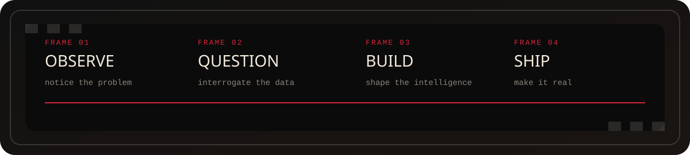
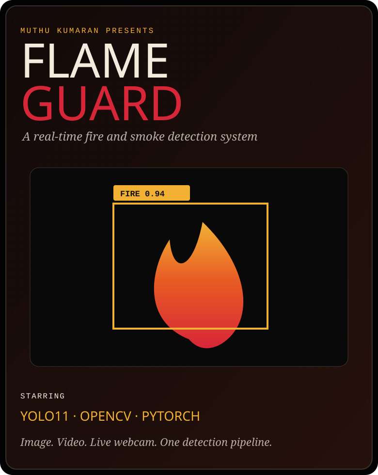
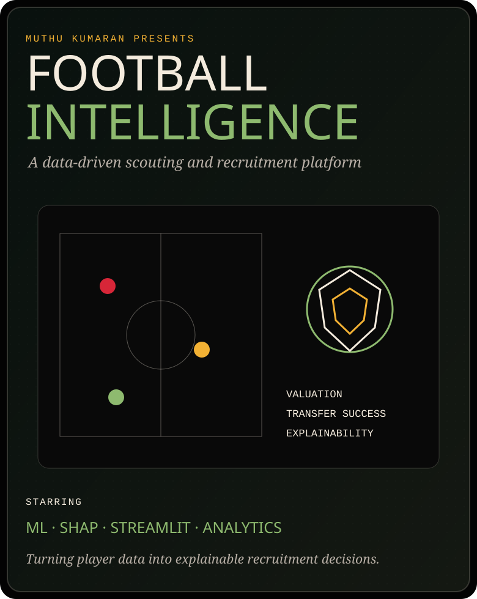
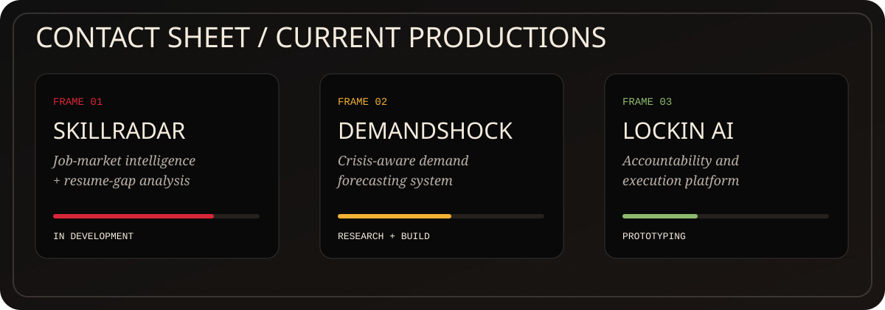
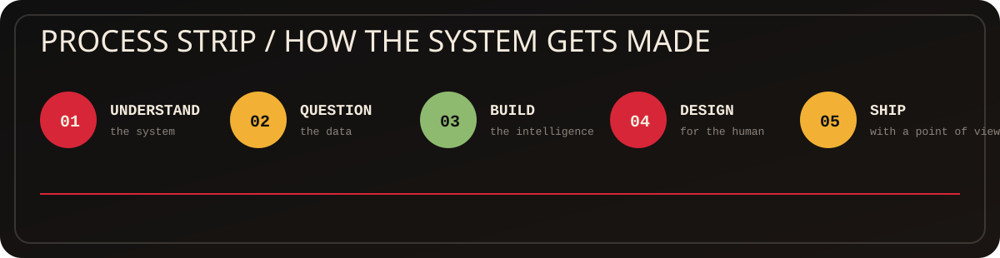

<div align="center">


<br>

<a href="https://github.com/muthukumaranL/flameguard-ai">
  
</a>
<a href="https://github.com/muthukumaranL/Football-Intelligence-Scouting-Platform">
  
</a>
<a href="https://muthukumaranl.vercel.app/">
  
</a>

<details>
<summary><b>Production notes</b></summary>
<br>

Scene 01 — FlameGuard: fine-tuned YOLO11, OpenCV, PyTorch, Streamlit, and image/video/live-webcam inference.

Scene 02 — Football Intelligence: valuation, future-value prediction, transfer-success prediction, SHAP explainability, and Streamlit deployment.

</details>

</div>

---

<table>
<tr>
<td width="62%" valign="top">

## `THE SUBJECT`

# Muthu Kumaran

**Building the Bridge Between Data, AI, Business and Storytelling.**

My work starts with a messy real-world problem and ends with something people can actually use: a prediction system, computer-vision application, intelligent assistant, decision platform, or interactive data product.

The objective is not merely to train a model.

The objective is to create a system that is:

**useful · explainable · deployable · memorable**

</td>
<td width="38%" valign="top">

## `PRODUCTION CARD`

```yaml
location: Mississauga, Ontario
role:
  - AI/ML Engineer
  - Data Analyst
  - Business Analyst
current_focus:
  - LLM applications
  - RAG
  - AI agents
  - MLOps / LLMOps
```

</td>
</tr>
</table>



---

## `SELECTED FILMS`

<table>
<tr>
<td width="50%" valign="top">

<a href="https://github.com/muthukumaranL/flameguard-ai">
  
</a>

### **FlameGuard**
#### Real-Time Fire & Smoke Detection

A computer-vision system that detects fire and smoke through images, video, and live webcam streams using a fine-tuned **YOLO11** model.

`YOLO11` `OpenCV` `PyTorch` `Streamlit`

[**View production →**](https://github.com/muthukumaranL/flameguard-ai) · [**Live cut →**](https://flameguardai.streamlit.app)

</td>
<td width="50%" valign="top">

<a href="https://github.com/muthukumaranL/Football-Intelligence-Scouting-Platform">
  
</a>

### **Football Intelligence**
#### Data-Driven Scouting Platform

An explainable recruitment platform for player valuation, future-value forecasting, transfer-success prediction, comparisons, and scouting decisions.

`Machine Learning` `SHAP` `Streamlit` `Sports Analytics`

[**View production →**](https://github.com/muthukumaranL/Football-Intelligence-Scouting-Platform) · [**Live cut →**](https://football-intelligence-scouting-platform.streamlit.app)

</td>
</tr>
</table>

<details>
<summary><b>Open FlameGuard production notes</b></summary>
<br>

**Problem:** Traditional fire monitoring can be expensive, isolated, or dependent on dedicated hardware.

**System:** A media and webcam pipeline runs YOLO11 inference, filters detections, draws annotations, and serves the experience through Streamlit.

**Demonstrates:** object detection, real-time inference, OpenCV processing, model integration, and product deployment.

</details>

<details>
<summary><b>Open Football Intelligence production notes</b></summary>
<br>

**Problem:** Football recruitment often combines fragmented statistics with subjective judgement.

**System:** A deployed platform cleans player data, engineers football-specific features, predicts future value and transfer success, and generates explainable recruitment insights.

**Synthetic validation:** future-value R² around **0.92**, MAE around **€0.46M**, and transfer-success ROC-AUC around **0.84**.

</details>

---

## `IN DEVELOPMENT`



---

## `TOOLS OF THE TRADE`

<div align="center">


</div>

<br>

<table>
<tr>
<td width="33%" valign="top">

### Intelligence

`Python` · `pandas` · `NumPy`  
`scikit-learn` · `TensorFlow`  
`PyTorch` · `YOLO` · `OpenCV`  
`NLP` · `LLM` · `RAG` · `XAI`

</td>
<td width="33%" valign="top">

### Data

`SQL` · `Power BI` · `DAX`  
`Power Query` · `Tableau`  
`EDA` · `Data Modelling`  
`KPI Reporting` · `Dashboards`

</td>
<td width="33%" valign="top">

### Production

`FastAPI` · `Streamlit` · `REST`  
`Docker` · `GitHub Actions`  
`React` · `TypeScript` · `Vercel`  
`Testing` · `Deployment`

</td>
</tr>
</table>

---

## `THE METHOD`



```text
MESSY PROBLEM
      ↓
UNDERSTAND THE SYSTEM
      ↓
QUESTION THE DATA
      ↓
BUILD THE INTELLIGENCE
      ↓
DESIGN FOR THE HUMAN
      ↓
SHIP WITH A POINT OF VIEW
```

---

## `ACTIVITY ARCHIVE`

<div align="center">


</div>

---
## `OUTSIDE THE FRAME`

```text
CINEMA                 MUSIC
VISUAL STORYTELLING    PRODUCT DESIGN
PHILOSOPHY             POLITICS
CYBERSECURITY          CREATIVE TECHNOLOGY
```

<div align="center">

## `FINAL FRAME`

[**PORTFOLIO**](https://muthukumaranl.vercel.app/) ·
[**LINKEDIN**](https://linkedin.com/in/muthukumaranl) ·
[**EMAIL**](mailto:muthu.kumaran2502@gmail.com)


</div>
