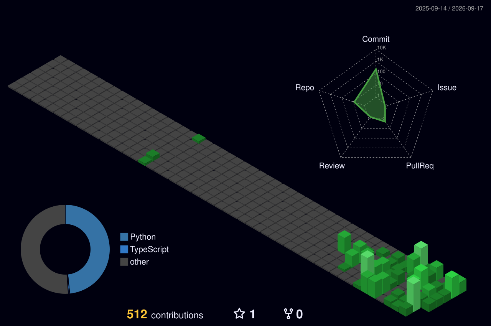

<div align="center">



<br>

<a href="https://git.io/typing-svg">
  
</a>

<br><br>

<a href="https://muthukumaranl.vercel.app/">
  
</a>
<a href="https://linkedin.com/in/muthukumaranl">
  
</a>
<a href="mailto:muthu.kumaran2502@gmail.com">
  
</a>

<br><br>


</div>

---

```console
muthu@github:~$ whoami
```

# Muthu Kumaran

```text
ROLE        Applied AI Developer · Data Analyst · System Builder
LOCATION    Mississauga, Ontario, Canada
MISSION     Turn raw data and strange ideas into useful digital products
MODE        Learning loudly. Building publicly. Improving continuously.
STATUS      Open to Data Analyst, ML Engineer and AI Engineer opportunities
```

I build projects at the intersection of **artificial intelligence, data, product thinking, visual design, and storytelling**.

My work usually begins with a messy real-world problem and ends with something people can actually explore: a prediction system, interactive dashboard, computer-vision application, intelligent assistant, or data product.

I am especially interested in systems that do more than produce a model score. I want the result to be **explainable, interactive, deployable, and visually memorable**.

---

```console
muthu@github:~$ ./launch_featured_projects.sh
```

## Featured Programs

<table>
<tr>
<td width="50%" valign="top">

### `01 // FLAMEGUARD`


**Real-Time Fire and Smoke Detection**

A computer-vision application that detects fire and smoke from images, videos, and live webcam streams using a fine-tuned YOLO11 model.

The project combines object detection, confidence filtering, visual annotations, real-time inference, and an interactive Streamlit interface.

**Core modules**

`YOLO11` `Computer Vision` `OpenCV`
`PyTorch` `Streamlit` `Python`

<br>

<a href="https://github.com/muthukumaranL/flameguard-ai">
  
</a>

</td>

<td width="50%" valign="top">

### `02 // FOOTBALL INTELLIGENCE`


**Machine-Learning Scouting Platform**

A data-driven recruitment platform for evaluating football players through player valuation, future-value forecasting, transfer-success prediction, similarity analysis, and explainable scouting insights.

The platform transforms player data into an interactive decision-support product for recruitment teams.

**Core modules**

`Machine Learning` `SHAP` `Analytics`
`scikit-learn` `Streamlit` `Python`

<br>

<a href="https://github.com/muthukumaranL/Football-Intelligence-Scouting-Platform">
  
</a>

</td>
</tr>
</table>

---

```console
muthu@github:~$ cat current_experiments.log
```

## Currently Building

```text
┌──────────────────────────────────────────────────────────────────────┐
│  [01] SKILLRADAR                                                    │
│                                                                      │
│  Job-market intelligence and resume-gap analysis platform           │
│  NLP · LLMs · RAG · Skill Extraction · Career Analytics             │
│                                                                      │
│  STATUS  ███████░░░  IN DEVELOPMENT                                 │
├──────────────────────────────────────────────────────────────────────┤
│  [02] DEMANDSHOCK                                                   │
│                                                                      │
│  Crisis-aware retail demand forecasting system                      │
│  Time Series · M5 Dataset · Explainability · MLOps                   │
│                                                                      │
│  STATUS  ████░░░░░░  RESEARCHING                                   │
├──────────────────────────────────────────────────────────────────────┤
│  [03] LOCKIN AI                                                     │
│                                                                      │
│  Goal-execution and personal accountability application             │
│  AI Agents · Progress Intelligence · Product Engineering            │
│                                                                      │
│  STATUS  ███░░░░░░░  PROTOTYPING                                   │
└──────────────────────────────────────────────────────────────────────┘
```

---

```console
muthu@github:~$ inspect --capabilities
```

## System Capabilities

<table>
<tr>
<td valign="top" width="33%">

### `INTELLIGENCE`

```text
Python
pandas
NumPy
scikit-learn
TensorFlow
PyTorch
YOLO
OpenCV
NLP
Time Series
Explainable AI
```

</td>

<td valign="top" width="33%">

### `DATA`

```text
SQL
Power BI
DAX
Power Query
Tableau
Excel
Data Cleaning
EDA
Data Modelling
KPI Reporting
Dashboard Design
```

</td>

<td valign="top" width="33%">

### `ENGINEERING`

```text
FastAPI
Streamlit
Git
GitHub
Docker
REST APIs
React
TypeScript
Vercel
Testing
Deployment
```

</td>
</tr>
</table>

<div align="center">


</div>

---

```console
muthu@github:~$ python engineering_philosophy.py
```

```python
class MuthuKumaran:
    def __init__(self):
        self.identity = [
            "AI builder",
            "data explorer",
            "visual thinker",
            "storyteller"
        ]

    def solve(self, messy_problem):
        context = understand_the_system(messy_problem)
        data = collect_clean_and_question(context)
        intelligence = build_and_evaluate(data)
        product = make_it_useful(intelligence)
        story = make_it_understandable(product)

        return deploy(product, story)

    def current_goal(self):
        return "Build systems that escape the notebook."
```

---

```console
muthu@github:~$ git status
```

## Current Status

```diff
+ Building production-oriented AI portfolio projects
+ Learning LLM applications, RAG and agentic workflows
+ Improving backend engineering and deployment skills
+ Creating interfaces that make technical systems approachable
+ Preparing for Data Analyst, ML Engineer and AI Engineer roles

! Refusing to become a tutorial collector
! Converting learning into working projects
! Shipping before everything feels perfect
```

---

```console
```console
muthu@github:~$ ./render_activity.sh
```

## Development Activity

<div align="center">


<br>

 

<br>

 

</div>

---

```console
muthu@github:~$ ./render_3d_contribution_matrix.sh
```

## 3D Contribution Matrix

<div align="center">



</div>

---

```console
muthu@github:~$ ./release_contribution_creature.sh
```

<div align="center">


</div>

---

```console
muthu@github:~$ ls interests/
```

```text
artificial-intelligence/     filmmaking/
machine-learning/            visual-storytelling/
data-intelligence/           product-design/
cybersecurity/               philosophy/
football-analytics/          creative-technology/
```

Technology is only one side of my work. I am also interested in cinema, design, storytelling, philosophy, politics, football, and the strange ways people interact with systems.

Those interests influence how I build: technically functional, visually intentional, and structured around a clear story.

---

```console
muthu@github:~$ connect --channel
```

## Establish Connection

I am interested in projects involving applied AI, machine learning, data products, LLM applications, computer vision, interactive analytics, and creative technology.

<div align="center">

<a href="https://muthukumaranl.vercel.app/">
  
</a>

<br><br>

<a href="https://linkedin.com/in/muthukumaranl">
  
</a>
<a href="mailto:muthu.kumaran2502@gmail.com">
  
</a>
<a href="https://github.com/muthukumaranL">
  
</a>

<br><br>

```text
END OF TRANSMISSION
SYSTEM REMAINS ONLINE
```

</div>
